# OR-Engineer

## A Performance-First Agent for Real-World Operational Problems

**OR-Engineer** autonomously takes a business operational problem from raw problem description and data to a validated, deployment-ready decision system. It handles the complete workflow: data inspection, mathematical formulation, method exploration, method selection, environment and solver audit, implementation, debugging, tuning, benchmarking, delivery, and technical reporting.

**Performance comes first.** OR-Engineer searches for the highest-quality deployable solution under the confirmed data, feasibility, runtime, hardware, and licensing constraints. It does not default to the easiest heuristic or the first method that runs. Mathematical programming, theoretical methods, machine learning, simulation, and hybrid approaches compete on solution quality, feasibility, robustness, evidence, and implementation effort before a primary method is selected.

The result is an agent that can autonomously run through a commercial OR scenario end to end. Users retain control through explicit decision gates, while the agent performs the technical work between those gates and supports every recommendation with benchmarks, diagnostics, and reproducible artifacts.

| Core property | OR-Engineer behavior |
|---|---|
| Primary objective | Maximize deployable decision performance, not implementation convenience |
| Autonomy | Execute the full problem-to-production OR workflow with minimal user intervention |
| Method choice | Compare analytical, solver-based, learning-based, and hybrid candidates |
| Business readiness | Validate data, constraints, environment, dependencies, runtime, and operational outputs |
| Evidence | Benchmark against competent baselines, fallbacks, and bounds before delivery |
| User control | Pause at high-value formulation, method, deployment, and acceptance decisions |

Created and maintained by [Xiaotian Liu](mailto:xiaotianliu01@gmail.com).

## What OR-Engineer Does

- Translates business objectives, operating rules, uncertainty, and raw data into a rigorous mathematical decision model.
- Explores three method families in parallel: theoretical analysis and heuristics, mathematical programming and solvers, and machine learning methods.
- Builds a performance-ceiling versus implementation-effort frontier instead of prematurely choosing the simplest runnable method.
- Selects a high-performing primary method together with a faithful fallback, competent baselines, and—when useful—lower or upper bounds.
- Audits runtimes, Python environments, packages, solvers, licenses, and accelerators before implementation.
- Autonomously implements, debugs, tests, tunes, and improves the selected method within the approved budget.
- Rejects weak configurations through pilot evidence and benchmark results rather than handing off an unvalidated prototype.
- Builds a delivery-ready project with editable configuration, progress reporting, structured outputs, run commands, and reproducibility records.
- Keeps the user in control through formulation, method-selection, deployment, and result-acceptance gates.
- Produces static stage reports, a run manual, and a final technical report suitable for technical and business review.

## Usage Guide

### 1. Install the skill in Codex

Copy the [`or-engineer`](or-engineer/) directory into your Codex skills directory:

```bash
mkdir -p "${CODEX_HOME:-$HOME/.codex}/skills"
cp -R ./or-engineer "${CODEX_HOME:-$HOME/.codex}/skills/or-engineer"
```

On Windows PowerShell:

```powershell
New-Item -ItemType Directory -Force "$HOME\.codex\skills" | Out-Null
Copy-Item -Recurse -Force ".\or-engineer" "$HOME\.codex\skills\or-engineer"
```

Restart Codex after installation if the skill is not discovered immediately.

### 2. Start with a decision problem

Invoke the skill explicitly and describe the operational decision, data, objective, constraints, uncertainty, runtime expectations, and deployment requirements. See examples in case study listed below.

Attaching the actual data is strongly recommended. If business parameters are missing, state which values may be estimated or replaced with documented OR baselines.

### 3. Review the decision gates

In a normal interactive run, OR-Engineer pauses at four meaningful gates:

1. **Formulation confirmation** — verify the mathematical model, data interpretation, assumptions, and gaps.
2. **Method selection** — choose or challenge the recommended primary method and fallback.
3. **Deployment approval** — approve the implementation plan, environment, solver, dependencies, and validation budget.
4. **Result acceptance** — inspect the completed run, baseline comparison, limitations, and reproducibility evidence.

### 4. Run and review the delivered project

After deployment, use the generated foreground `run` command. Return the saved logs and result folder to OR-Engineer for analysis, debugging, iteration, and final reporting.

## Workflow

```mermaid
%%{init: {
  "theme": "base",
  "flowchart": {
    "curve": "linear",
    "htmlLabels": false,
    "nodeSpacing": 55,
    "rankSpacing": 45
  }
}}%%

flowchart TB

    START(["User provides operational problem, data, and goals"])

    H1["1 · PROBLEM FORMULATION"]
    F1["Inspect requirements and data"]
    F2["Build the mathematical model"]
    F3[/"Formulation Report"/]
    Q1{"User confirms formulation"}

    START --> H1 --> F1 --> F2 --> F3 --> Q1
    Q1 -. "Revise" .-> F1

    H2["2 · PARALLEL METHOD EXPLORATION"]
    P["Share the confirmed formulation"]

    A["Analyzer"]
    O["Optimizer"]
    T["Trainer"]

    AD["Theoretical analysis and heuristics"]
    OD["Mathematical programming and solvers"]
    TD["Machine learning methods"]

    Q1 -- "Confirmed" --> H2 --> P

    P --> A --> AD
    P --> O --> OD
    P --> T --> TD

    R["Reviewer synthesis"]
    C["Compare quality, effort, risk, and evidence"]
    M["Define primary method, fallback, and baselines"]
    MR[/"Method Selection Report"/]
    Q2{"User selects a method"}

    AD --> R
    OD --> R
    TD --> R

    R --> C --> M --> MR --> Q2
    Q2 -. "Explore again" .-> P

    H3["3 · DEPLOYMENT PLANNING"]
    D1["Select reusable assets"]
    D2["Audit runtime, solvers, GPU, and licenses"]
    D3["Design implementation and validation"]
    DR[/"Deployment Report"/]
    Q3{"User approves deployment"}

    Q2 -- "Selected" --> H3
    H3 --> D1 --> D2 --> D3 --> DR --> Q3
    Q3 -. "Revise" .-> D1

    H4["4 · BUILD AND VALIDATE"]
    B1["Build the delivery-ready project"]
    B2["Run smoke tests"]
    B3["Run pilots against strong baselines"]
    B4["Improve within the approved budget"]
    B5["Clean the project and prepare the run manual"]

    Q3 -- "Approved" --> H4
    H4 --> B1 --> B2 --> B3 --> B4 --> B5

    H5["5 · USER RUN AND FEEDBACK"]
    U1(["User runs the final job"])
    E1["Review logs, results, and benchmarks"]
    Q4{"Results accepted"}
    FIX["Fix issues and repeat validation"]

    B5 --> H5 --> U1 --> E1 --> Q4
    Q4 -- "No" --> FIX
    FIX -. "Iterate" .-> B1

    H6["6 · SUMMARY AND ARCHIVE"]
    S1["Combine model, method, code, and results"]
    S2[/"Final Technical Report"/]
    END(["Reproducible project archive"])

    Q4 -- "Yes" --> H6
    H6 --> S1 --> S2 --> END

    classDef phase fill:#344767,stroke:#344767,color:#FFFFFF,stroke-width:2px;
    classDef user fill:#E8F7F0,stroke:#16835F,color:#103D30,stroke-width:2px;
    classDef process fill:#EEF3FF,stroke:#526FD5,color:#1F316D,stroke-width:1.5px;
    classDef specialist fill:#F3EEFF,stroke:#8061C9,color:#3C266F,stroke-width:1.5px;
    classDef review fill:#EAF7FC,stroke:#2985A5,color:#164A5E,stroke-width:1.5px;
    classDef report fill:#F5F6F8,stroke:#7C8798,color:#303846,stroke-width:1.5px;
    classDef decision fill:#FFF4D8,stroke:#C98200,color:#674300,stroke-width:2px;
    classDef finish fill:#FCECF4,stroke:#C04A82,color:#692544,stroke-width:2px;

    class H1,H2,H3,H4,H5,H6 phase;
    class START,U1 user;
    class F1,F2,P,C,M,D1,D2,D3,B1,B2,B3,B4,B5,E1,FIX,S1 process;
    class A,O,T,AD,OD,TD specialist;
    class R review;
    class F3,MR,DR,S2 report;
    class Q1,Q2,Q3,Q4 decision;
    class END finish;
```



## End-to-End Case Studies

The following three cases demonstrate that the agent does not force every business problem into the same algorithm. It autonomously selected mathematical programming for nonlinear production scheduling, machine learning for feature-conditioned inventory decisions, and stochastic programming for operating-room assignment. It validated each choice against problem-appropriate baselines.

These are actual OR-Engineer runs. Each case used **GPT-5.5 High**. Development was **fully autonomous and end to end**: the user supplied only the original prompt, while GPT performed the data inspection, formulation, method exploration and selection, deployment design, implementation, debugging, testing, tuning, benchmarking, and reporting. The user made **no modifications and provided no corrective feedback** during development.

### Case 1 — Multi-Echelon BOM Production Scheduling

| Run metadata | Value |
|---|---|
| Model | **GPT-5.5 High** |
| Development mode | **Fully autonomous GPT end-to-end development** |
| User involvement | Original prompt only; **no user modifications or feedback** |
| Selected primary method | Rolling-horizon SAA PWL MILP/MPC |

<summary><strong>Original prompt</strong></summary>

```text
Help me design an intelligent production scheduling strategy for a multi-echelon production network. The topology of this network is calculated based on the BOM (Bill of Materials) and will be provided as a matrix $\boldsymbol{M}$, where $M_{ij}$ represents the number of units of $i$ required to produce one unit of $j$. Regarding the business pain point and core model, our current scheduling logic is too idealized, assuming infinite shop-floor capacity and Fixed Planned Lead Times (FPLT). We must change this by introducing a Clearing Function (CF) to constrain capacity, meaning the actual production output $P_t$ is a nonlinear concave function of the current Work-in-Process (WIP) plus the planned production quantity $Q_t$ for the current period: $P_t = \varphi(W_t + Q_t)$, which makes the entire production model highly nonlinear. In terms of network constraints and costs, there are two types of nodes in the system subject to different constraints. External nodes (customer-facing) face random demand $D_t$, where shortages are allowed (incurring backlog costs), and the state transition equation is $I_{t+1} = I_t - D_t + P_t$. Internal nodes (supplying downstream) strictly prohibit shortages and must satisfy the material withdrawal demand of downstream nodes (a hard constraint), with the state transition equation being $I_{t+1} = I_t - \sum_{j} M_{ij} Q^j_t + P_t$. The cost $C_t$ for each node includes an inventory holding cost that is linear with respect to the inventory level, a shortage cost (for external nodes only) that is linear with respect to the backlog, and a fixed setup cost incurred each time production starts (a fixed charge modeled with an indicator variable). Your task is to minimize the total expected cost of the system. However, due to the introduction of the nonlinear CF and the fixed setup costs, this problem is now non-convex. The data is located in the MSOM Excel file within the current directory, where the CF is exponential, monotonically increasing, and concave, the $\boldsymbol{M}$ matrix values are all set to $1$, and the remaining parameters should be set to reasonable Operations Research baseline values, with the initial inventory set to $5$ times the demand to ensure the system does not experience a stockout at the beginning.
```

#### What GPT autonomously built

GPT formulated a stochastic, capacity-constrained multi-echelon production model with WIP, inventory, backlog, fixed setup costs, hard internal material-feasibility constraints, and an exponential concave clearing function. It then selected a **rolling-horizon sample-average-approximation, piecewise-linear MILP/MPC policy**. At each period, the policy solves a scenario-based look-ahead MILP, applies the first production-release decision, updates the system with realized demand and the true clearing function, and repeats.

The autonomous workflow also produced a deterministic quantile-inflated PWL MILP fallback, Gurobi and HiGHS solver routes, classical gross-requirement and lot-for-lot baselines, structured run records, and the complete stage-report chain.

#### Result

On the reported pilot scope—MSOM chain 1, four planning periods, five optimization scenarios, and four held-out evaluation scenarios—the primary method achieved:

- **Mean total cost:** 1,010.47
- **Service rate:** 1.00
- **Internal material violations:** 0
- **Cost reduction versus the strongest tuned classical baseline:** **51.35%**
- **Deterministic PWL MILP fallback cost:** 1,013.56, only **0.31%** above the primary method

This validates the implementation and method on the configured small-chain scope. The report explicitly does not claim an all-38-chain production benchmark.

**Evidence:** [original prompt](BOM/prompt.txt) · [formulation report](BOM/formulation_confirmation_report.html) · [method selection](BOM/method_selection_report.html) · [deployment plan](BOM/deployment_confirmation_report.html) · [run manual](BOM/project_delivery_run_manual.html) · [final technical report](BOM/final_technical_report.html)

### Case 2 — Feature-Based Walmart Newsvendor

| Run metadata | Value |
|---|---|
| Model | **GPT-5.5 High** |
| Development mode | **Fully autonomous GPT end-to-end development** |
| User involvement | Original prompt only; **no user modifications or feedback** |
| Selected primary method | Quantile gradient boosting |

<details>
<summary><strong>Original prompt</strong></summary>

```text
$or-engineer Help me design a data-driven inventory decision model for a feature-based newsvendor problem using the
  public Walmart retail dataset in the current folder, try different critical ratios
```

</details>

#### What GPT autonomously built

GPT recognized that the available Walmart data supports a **single-period, store-week sales-dollar newsvendor model**, not SKU-level physical replenishment. It created leakage-safe temporal features, evaluated critical ratios `{0.50, 0.60, 0.70, 0.80, 0.90, 0.95}`, and selected a scikit-learn **histogram gradient boosting quantile model** that directly estimates feature-conditioned newsvendor quantiles.

The generated system includes quantile-crossing diagnostics and repair, temporal train/validation/test splits, global/store/rolling/calendar empirical-quantile baselines, a sparse SciPy/HiGHS quantile-LP diagnostic fallback, model persistence, structured outputs, and a foreground run command.

#### Result

- **Validation normalized pinball loss:** 0.020474
- **Strongest validation baseline:** 0.024460 (`rolling_store_quantile_52`)
- **Validation improvement:** **16.30%**, exceeding the declared 3% acceptance gate
- **Final test normalized pinball loss:** 0.016377
- **Strongest final-test baseline:** 0.020065 (`rolling_store_quantile_26`)
- **Completed runtime:** 106.55 seconds

The result is valid for aggregate store-week sales-dollar decisions. It is not presented as SKU replenishment or profit-optimal physical inventory control because unit demand, inventory, lead-time, cost, and capacity data were unavailable.

**Evidence:** [original prompt](newsvendor/prompt.txt) · [formulation report](newsvendor/formulation_confirmation_report.html) · [method selection](newsvendor/method_selection_report.html) · [deployment plan](newsvendor/deployment_confirmation_report.html) · [run manual](newsvendor/project_delivery_and_run_manual.html) · [final technical report](newsvendor/final_technical_report.html)

### Case 3 — Stochastic Operating Room Assignment

| Run metadata | Value |
|---|---|
| Model | **GPT-5.5 High** |
| Development mode | **Fully autonomous GPT end-to-end development** |
| User involvement | Original prompt only; **no user modifications or feedback** |
| Selected primary method | Empirical-scenario SAA MILP |

<details>
<summary><strong>Original prompt</strong></summary>

```text
I'm working on a stochastic Operating Room (OR) scheduling problem using surgical duration data extracted from cav file in this folder.The core task is to assign a set of $N$ elective surgeries to $M$ operating rooms. The main challenge is that the actual duration of each surgery, $D_i$, is a highly variable random variable. Let $x_{ij} \in \{0, 1\}$ be the binary decision variable indicating whether surgery $i$ is assigned to room $j$. Each room has a regular scheduled session length $T_j$. We face a classic trade-off: if the total duration of surgeries in a room falls short, we incur an expensive idle capacity cost $c_u$; if it exceeds the scheduled time, we pay a heavy overtime penalty $c_o$.The objective is to minimize the total expected cost across all rooms:$$\min_{\boldsymbol{x}} \sum_{j=1}^M \mathbb{E} \left[ c_u \max\left(0, T_j - \sum_{i=1}^N D_i x_{ij}\right) + c_o \max\left(0, \sum_{i=1}^N D_i x_{ij} - T_j\right) \right]$$subject to the assignment constraint $\sum_{j=1}^M x_{ij} = 1$ for all $i$.Since evaluating this multidimensional expectation over complex clinical distributions is notoriously difficult, could you help me formulate a tractable mathematical framework for this problem?
```

</details>

#### What GPT autonomously built

GPT formulated a two-stage stochastic assignment model and selected an **empirical-scenario sample-average-approximation MILP**. CPT- and service-conditioned duration scenarios represent uncertainty; binary first-stage decisions assign every case to exactly one room; scenario recourse variables measure idle and overtime minutes.

The implementation uses Gurobi as the preferred solver with a SciPy/HiGHS fallback, includes a small workload-balancing tie-breaker, and evaluates the primary method against risk-adjusted LPT, mean-duration LPT, booked-time LPT, deterministic mean MILP, and an aggregate fluid lower bound.

#### Result

Across 12 held-out surgery lists, three seeds, 500 optimization scenarios, and 1,000 evaluation scenarios, the primary method achieved:

- **Mean expected cost:** 368.133
- **Feasibility violations:** 0
- **Improvement over the best risk-adjusted LPT baseline:** 0.601 cost units (**0.163%**)
- **Improvement over deterministic mean MILP:** 17.638 cost units
- **Improvement over booked-time LPT:** 69.813 cost units
- **Gap above the aggregate fluid lower bound:** **0.625%**
- **Pairwise wins:** 25/36 versus the best risk-LPT baseline, 33/36 versus deterministic mean MILP, and 36/36 versus booked-time LPT

The report treats this as a deployable stochastic-assignment baseline. It does not claim to model surgeon availability, equipment, room eligibility, sequencing, turnover, downstream beds, anesthesia teams, or hard overtime limits because those fields and constraints were not supplied.

**Evidence:** [original prompt](operating%20room/prompt.txt) · [formulation report](operating%20room/or_formulation_confirmation_report.html) · [method selection](operating%20room/or_method_selection_report.html) · [deployment plan](operating%20room/or_deployment_confirmation_report.html) · [run manual](operating%20room/or_project_delivery_manual.html) · [final technical report](operating%20room/or_final_technical_report.html)

## Repository Layout

```text
.
├── or-engineer/       # Installable Codex skill
├── BOM/               # Multi-echelon production scheduling case
├── newsvendor/        # Feature-based Walmart newsvendor case
├── operating room/    # Stochastic OR assignment case
└── README.md           # GitHub project homepage
```

Each case directory contains the original prompt and the formulation, method-selection, deployment, delivery, and final technical reports generated by the autonomous workflow.

## Performance-First Design Principle

OR-Engineer optimizes for the **best deployable decision performance under the confirmed constraints**, not the easiest code path or the fastest demonstration. A method is considered successful only when it is operationally feasible, reproducible, and supported by comparison against strong alternatives.

Simple heuristics remain valuable as transparent baselines, fallbacks, or warm starts, but a complex business problem is not reduced to a low-ceiling method without explicit evidence that stronger analytical, optimization, learning, or hybrid approaches are unnecessary or infeasible. If pilot performance is weak, the agent diagnoses the likely cause, improves the configuration or method within budget, and preserves the evidence behind the final decision.
